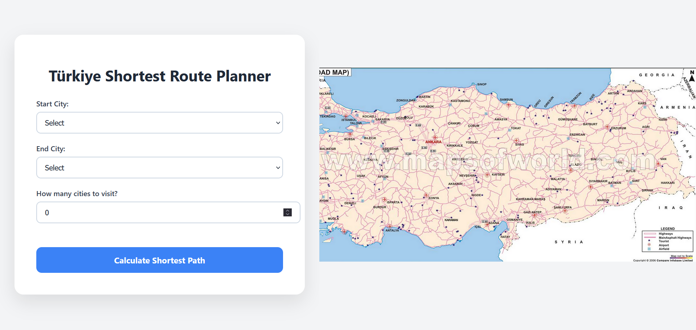
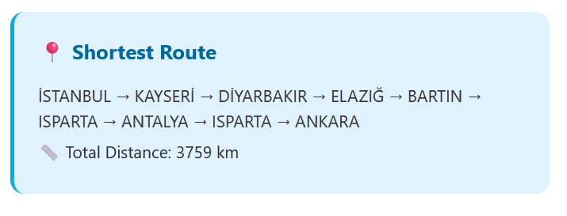

# 🇹🇷 Türkiye Route Planner 🗺️

A full-stack web application that calculates and visualizes the shortest path between Turkish cities using **Dijkstra's algorithm**, with a React-based frontend and Flask-based backend.







---

## 📁 Project Structure

```
react-shortest-path/
│
├── backend/                    # API + Path Finding
│   ├── app.py                  # Flask server with API routes
│   ├── ilmesafe.py             # Graph algorithm (Dijkstra)
│   ├── ilmesafe.xlsx           
│   ├── turkey_city_coordinates.csv  
│   └── __pycache__/           
│
├── frontend/                   
│   ├── src/
│   │   ├── App.jsx             
│   │   ├── MapView.jsx         
│   │   ├── main.jsx           
│   │   └── assets/             
│   ├── public/                 
│   ├── index.html              
│   └── package.json            
│
└── README.md                   
```

---

## 🚀 Features

- 🔁 Calculates shortest path between Turkish cities
- 🧠 Uses **Dijkstra's algorithm** on a city distance graph
- 🗺️ Displays full route with intermediate cities on a map
- ⚙️ Full-stack: Flask API + React frontend + Leaflet for mapping
- 🧭 Coordinates-based visualization (from real geo-data)

---

## ⚙️ How to Run Locally

### 1. Clone the repo

```bash
git clone https://github.com/huseyinTozluyurt/Turkiye-router-planner.git
cd Turkiye-router-planner
```

---

### 2. Start the Flask Backend

```bash
cd backend
pip install flask pandas flask-cors
python app.py
```

---

### 3. Start the React Frontend

```bash
cd frontend
npm install
npm run dev
```

---

### 4. Open the app

Visit: `http://localhost:5173`

---

## 📦 Dependencies

**Frontend (React):**

- React
- Vite
- Leaflet (for maps)
- Fetch API

**Backend (Flask):**

- Flask
- pandas
- flask-cors

---

## 📌 Notes

- You can modify the route logic inside `ilmesafe.py`
- City coordinates are in `turkey_city_coordinates.csv`
- Distance data is read from `ilmesafe.xlsx`

---

## 🧠 Future Improvements

- ✅ Show all intermediate cities on the map
- 🧭 Add reverse routing or alternative path options
- 🗃️ Add database support for real-time data

---

## ✍️ Author

**Hüseyin Tozluyurt**  
[GitHub Profile](https://github.com/huseyinTozluyurt)
